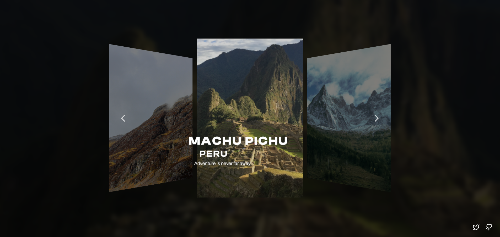

<h1>Voyage-Slider</h1>

<strong>Description :</strong>
 
Ce projet consiste à créer un carrousel ou slider interactif mettant en valeur des destinations de voyage inspirantes. Le slider affiche des images de paysages magnifiques, des villes emblématiques et des lieux exotiques. L'utilisateur peut naviguer à travers les destinations à l'aide de boutons ou d'une navigation automatique. Chaque slide contient une image, un titre, et une courte description de la destination.

Un effet de transition fluide entre les slides améliore l'expérience utilisateur, et un bouton ou un lien sur chaque slide permet d'en savoir plus sur la destination.

<strong>Fonctionnalités principales :</strong>

<ol><li>Navigation manuelle (flèches gauche/droite).</li><li>Défilement automatique après un certain délai.</li><li>Adaptabilité pour différents appareils (responsive design).</li><li>Effets visuels modernes .</li><li>Ajout d'une animation ou d'un texte interactif pour chaque destination.</li></ol>

<strong>Technologies Utilisées :</strong>

<ul><li><strong>HTML</strong> : Structure de base du slider.</li><li><strong>CSS</strong> : Styles pour le design, transitions, et adaptabilité.</li><li><strong>JavaScript</strong> : Fonctionnalité de navigation, défilement automatique et interactions.</li></ul>
